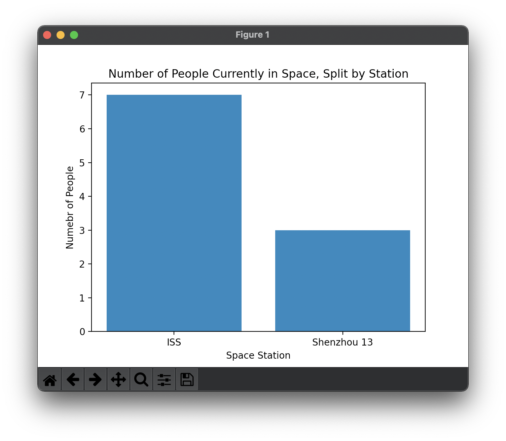
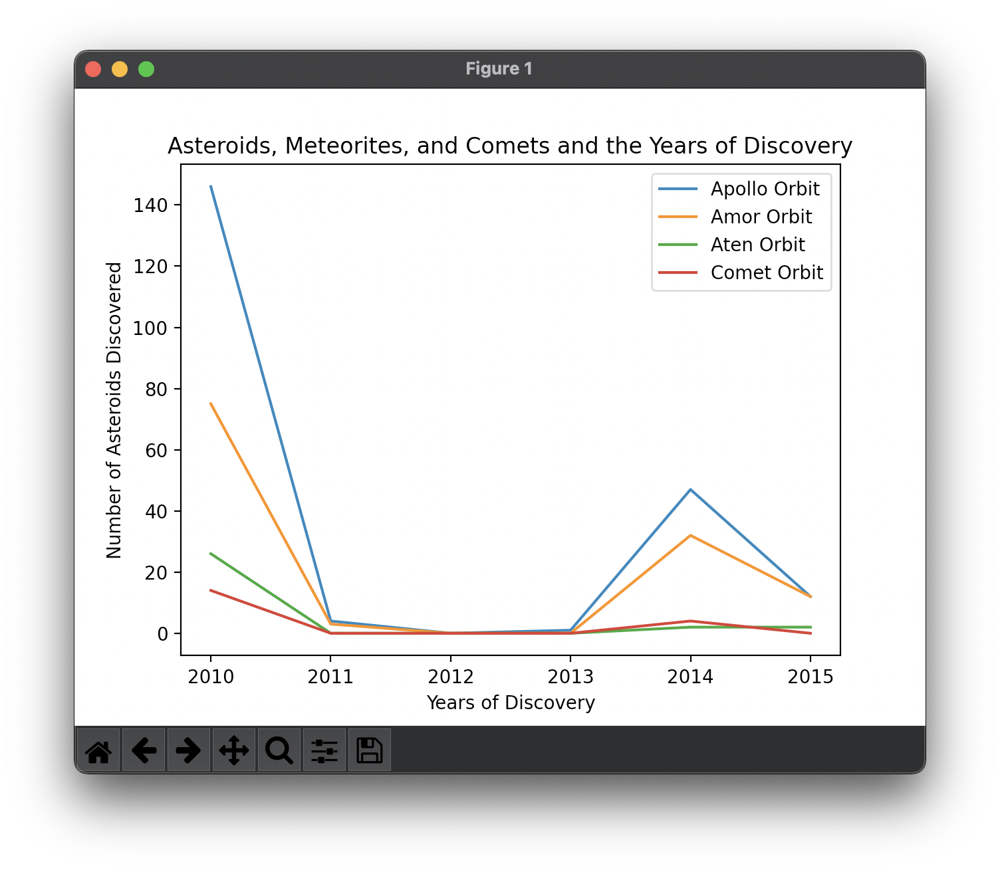

# hw_02

Here is the [homework instructions](https://github.com/mikeizbicki/cmc-csci040/tree/2021fall/hw_02)

## Graph One

**Number of People Currently In Space**

Graph 1 is showing [the number of people that are currently in space](http://api.open-notify.org/astros.json).

I decided to split them up by space station instead of something that is harder to determine, like gender or age. As shown above, there are 10 people in space currently. 7 of them are on the ISS and 3 on them are on Shenzhou 13. 

## Graph Two

**Asteriods, Comets, and Meteorites and Their Years of Discovery**

Graph 2 is showing both [earth meteorite landings](https://data.nasa.gov/resource/y77d-th95.json) and [asteroids and comets that are near Earth](https://data.nasa.gov/resource/2vr3-k9wn.json).

I decided to split them up by orbit class because that was the clearest distinction between all of the space objects. As shown above, there is quite a decrease in findings acorss all orbits classes after 2010. I am hopeful that these files get updated with mroe reent information, as there is no info after 2015 for the orbit classes that I chose. 